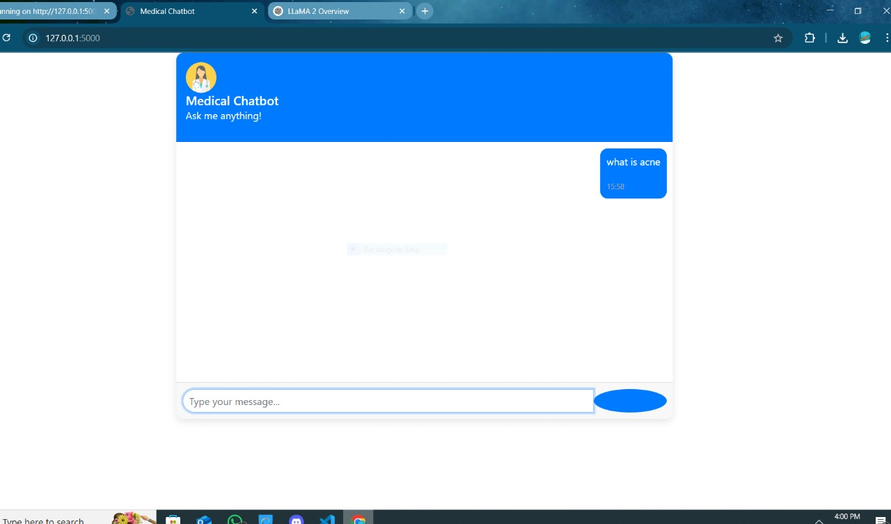

# **Medical Chatbot**

## **Overview**
This project is an AI-powered medical assistant built with Flask, Pinecone, and LangChain. It provides instant responses to health-related questions, including symptoms analysis, treatment information, and general medical advice using the LLaMA-2 language model.



---

## **Folder Structure**
- `app.py` contains the Flask backend and main application logic
- `templates/` holds the frontend HTML files
- `static/` includes CSS/JS for the web interface

---

## **Features**
- **AI-Powered Medical Assistance**:
  - Symptom analysis and possible conditions
  - Treatment information and medication details
  - General health advice
  - Emergency guidance (basic first aid)
- **Dual Interface**:
  - Web-based GUI (Flask)
  - API endpoint for programmatic access
- **Smart Features**:
  - Context-aware follow-up questions
  - Medical disclaimer system
  - Response confidence indicators

---

## **Dependencies**
### **System Requirements**
- Python 3.8+
- Pinecone account (for vector database)
- Minimum 4GB RAM

### **Core Libraries**
- Flask (web framework)
- LangChain (LLM orchestration)
- Pinecone (vector database)
- HuggingFace Transformers (LLaMA-2 model)
- Sentence-Transformers (embeddings)

---

## **Installation**
1. Clone the repository:
   ```bash
   git clone https://github.com/your-username/Medical-chatbot.git
   cd Medical-chatbot
